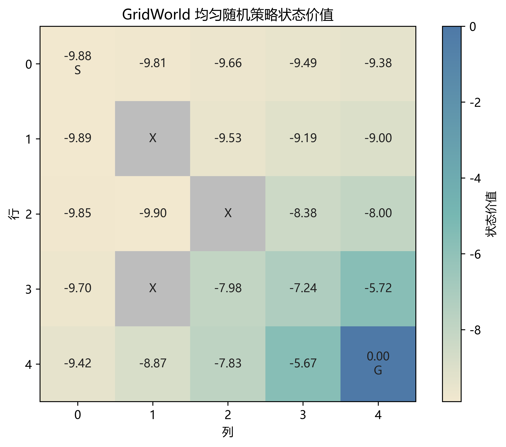
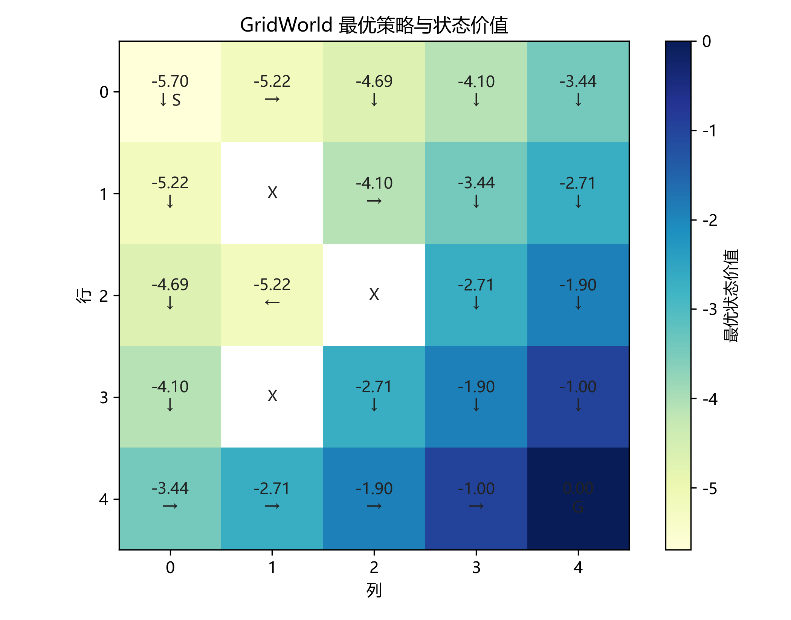
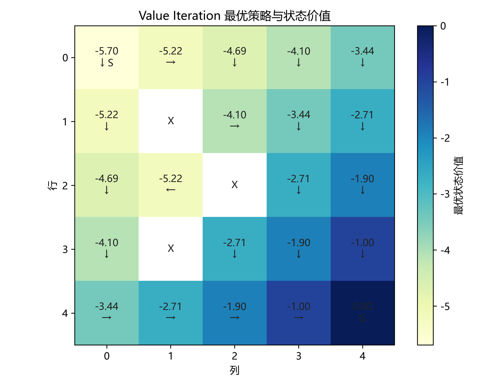
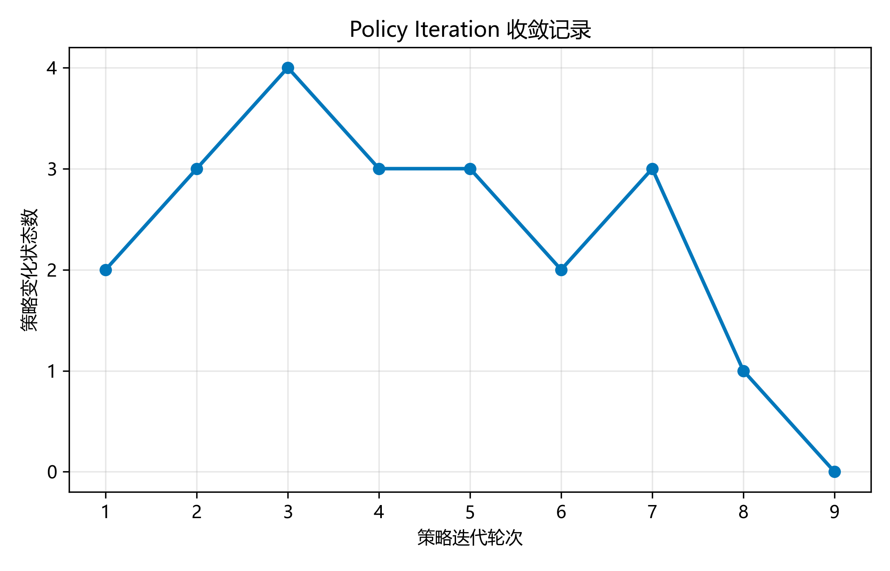
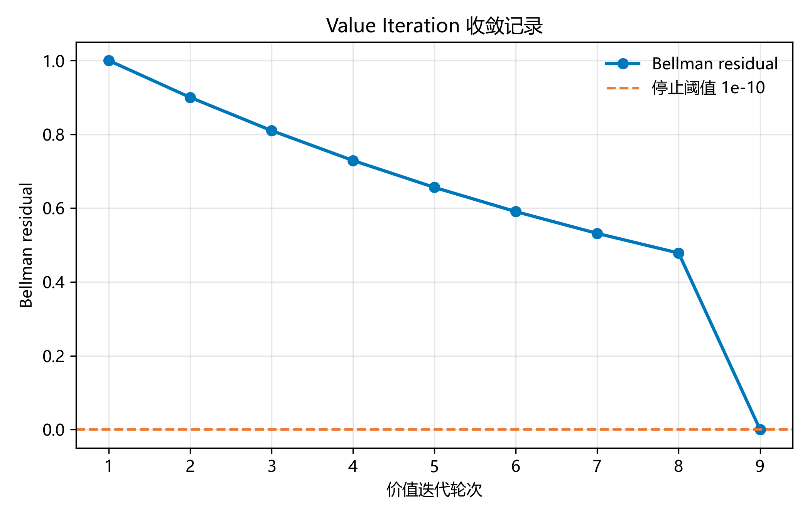

# 第一周报告：MDP 与动态规划算法

## 1. MDP 与 GridWorld 定义

本项目使用 Markov Decision Process（马尔可夫决策过程，MDP）描述序贯决策问题：

$$
M=(S,A,T,R,\gamma).
$$

其中，$S$ 为状态空间，$A$ 为动作空间，$T(s'\mid s,a)$ 为状态转移概率，$R(s,a)$ 为期望即时奖励，$\gamma$ 为折扣因子。统一接口 `env/mdp.py` 分别用 `states`、`actions(state)`、`transitions(state, action)`、`reward(state, action)` 和 `discount_factor` 表示这些要素。

第一周环境是确定性 $5\times5$ GridWorld。状态由非障碍物位置 $(row,col)$ 表示，共有 22 个合法状态；起点为 $(0,0)$，终点为 $(4,4)$，障碍物位于 $(1,1)$、$(2,2)$ 和 $(3,1)$。非终止状态可执行上、下、左、右四个动作。正常移动以概率 1 到达相邻位置，越界或撞击障碍物时保持原位。每次合法动作的奖励均为 $-1$，折扣因子为 $\gamma=0.9$。进入终点的动作仍获得 $-1$，随后任务结束，终止状态价值固定为 0。

## 2. 实现方法

### 2.1 Policy Evaluation

Policy Evaluation（策略评估）计算固定策略 $\pi$ 的状态价值。本实验使用均匀随机策略，每个非终止状态的四个动作概率均为 0.25。同步更新采用 Bellman 期望公式：

$$
V_{k+1}^{\pi}(s)=
\sum_a\pi(a\mid s)
\left[R(s,a)+\gamma\sum_{s'}T(s'\mid s,a)V_k^{\pi}(s')\right].
$$

每轮更新后计算 Bellman residual（贝尔曼残差）$\lVert V_{k+1}-V_k\rVert_\infty$，残差不大于 $10^{-8}$ 时停止。实现还检查策略是否包含非法动作、负概率或概率和不为 1 的情况。

### 2.2 Policy Iteration

Policy Iteration（策略迭代，PI）在策略评估和策略改进之间交替。策略评估直接复用前述实现；策略改进使用一步前瞻动作价值

$$
Q(s,a)=R(s,a)+\gamma\sum_{s'}T(s'\mid s,a)V(s')
$$

比较当前状态的全部合法动作。如果旧动作仍属于并列最优动作，算法保留旧动作，避免在等价动作之间反复切换。所有非终止状态的动作均不再改变时，策略被判定为稳定。

### 2.3 Value Iteration

Value Iteration（价值迭代，VI）不在每轮完整评估一个固定策略，而是直接执行 Bellman 最优更新：

$$
V_{k+1}(s)=
\max_a\left[R(s,a)+\gamma\sum_{s'}T(s'\mid s,a)V_k(s')\right].
$$

实现从全零价值开始，每轮先根据上一轮价值计算全部 `new_values`，再整体替换旧值。停止条件仍为全部状态中新旧价值差的最大值不超过阈值。价值迭代结束后，算法从最终价值函数中提取一次确定性贪心策略，并用 `tie_tolerance` 保存所有数值上并列的最优动作。

## 3. 实验结果

### 3.1 固定随机策略的价值

均匀随机策略的迭代式策略评估在 164 轮后达到 $10^{-8}$ 阈值，最终残差为 $9.3323\times10^{-9}$。终点价值为 0，其他状态价值均为负。靠近终点的状态通常具有更高价值；障碍物和边界会使随机动作停留在原地并继续获得 $-1$，因此相关状态的价值降低。

  

### 3.2 PI 与 VI 的最优策略

PI 和 VI 均得到从起点向下移动，再沿底部向右到达终点的八步路径。下图同时给出各状态的最优价值和确定性动作。两个算法在当前动作顺序和并列动作处理规则下输出相同策略。

  
  

PI 在第 9 轮策略改进后没有状态改变。VI 的残差依次为 $1,0.9,\ldots,0.4782969,0$，在第 9 轮达到停止条件。两种算法的迭代轮数相同，但每轮计算含义不同。

  
  

### 3.3 一致性检查

PI 与 VI 使用同一个 GridWorld，并以 $10^{-10}$ 作为内部价值计算的数值阈值。交叉验证比较了全部 22 个合法状态，而不是只比较起点。

| 检查项目 | 结果 |
| --- | ---: |
| PI 起点最优价值 | $-5.69532790$ |
| VI 起点最优价值 | $-5.69532790$ |
| 全状态最大价值差 | $0$ |
| 策略动作不同的状态数 | $0$ |
| 起点到终点路径长度 | 8 步 |
| 自动测试 | 24 项通过 |

从 $(0,0)$ 到 $(4,4)$ 至少需要 8 个动作，现有障碍物仍允许八步路径。每一步奖励为 $-1$，因此理论最优折扣回报为

$$
-\sum_{t=0}^{7}0.9^t=-5.6953279.
$$

理论结果、PI 输出和 VI 输出一致。有限折扣 MDP 的 PI 与 VI 都以最优价值函数为目标；即使存在多个并列最优动作，策略表示可以不同，但最优价值应当一致。当前实验没有出现策略差异。

## 4. 当前问题

把 Bellman 公式转换成代码仍不熟练。策略评估需要处理状态、动作和下一状态三层关系；价值迭代还需要区分上一轮与本轮价值，并对全部状态计算残差。实现过程中曾出现只检查循环结束时保留的一个状态、对浮点数误用字典方法等错误。通过把计算分解为下一状态期望、动作价值、状态价值和全状态残差，这些错误已经排查，但类似公式的独立实现仍需要练习。

测试与实验工具的使用还不熟练。早期测试依赖手动调用，测试发现和中文输出均不稳定，改用 `unittest` 后才形成统一入口；边界碰撞、终止状态、非法输入和并列最优动作等测试案例也需要提示才能覆盖。第一周的测试框架和部分 Matplotlib 绘图由 AI 辅助完成，目前对类的实例化、属性访问、异常测试、颜色映射和坐标设置尚不能熟练独立完成。

算法理论方面仍有两项问题需要向请教。VI 直接对所有动作取最大值，代码流程比 PI 简单，但两者在状态规模、折扣因子和精度要求变化时的计算代价如何比较，以及 PI 在什么条件下更合适，目前还没有形成清楚判断。教材给出的残差阈值 $\delta$ 与误差界 $\delta\gamma/(1-\gamma)$ 之间的关系也未完全理解。

## 5. 结论

第一周完成了统一有限 MDP 接口、确定性 GridWorld、迭代式策略评估、策略迭代和价值迭代。环境转移、奖励、终止状态、算法停止条件和贪心策略均有自动测试。PI 与 VI 在全部合法状态上的最优价值完全一致。现有接口和算法没有包含环境专用判断，可以在第二周直接用于 Minecraft-like MDP。
