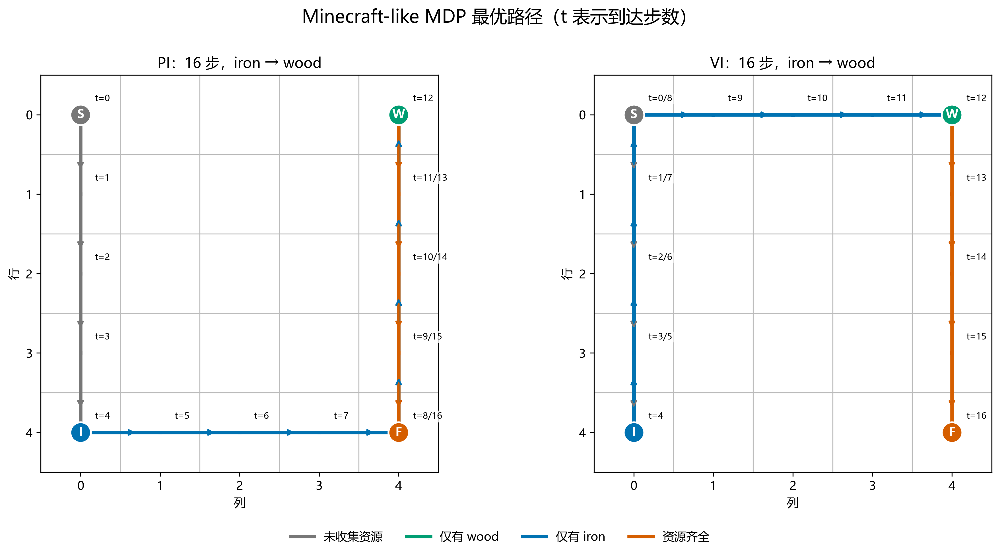
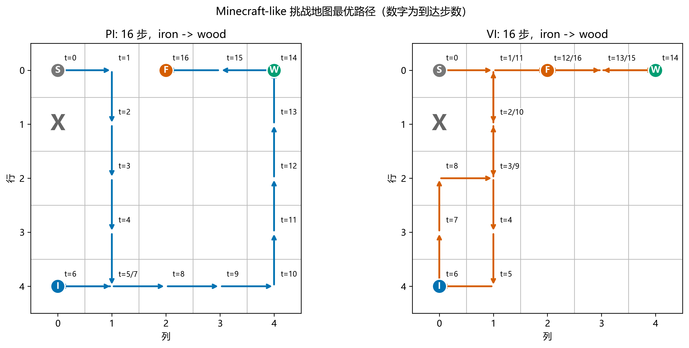

# 第二周 Minecraft-like MDP 阶段报告

## 1. 任务目标与范围

本周工作的目标是把 Minecraft-like Make Bridge 任务表示为有限 Markov Decision Process（马尔可夫决策过程，MDP），并检验第一周实现的动态规划算法能否在不增加环境专用判断的情况下直接求解该任务。任务要求智能体从起点出发，收集 wood 和 iron，再进入 factory 完成 bridge。实现范围包括环境建模、可达状态枚举、Policy Iteration（策略迭代，PI）与 Value Iteration（价值迭代，VI）求解、交叉验证和自动测试。

基线环境采用无障碍的 $5\times5$ 网格。起点、wood、iron 和 factory 分别位于 $(0,0)$、$(0,4)$、$(4,0)$ 和 $(4,4)$。这一对称布局使两种资源收集顺序都对应 16 步最短路径，地图本身不会预先指定先收集哪一种资源。

```text
S . . . W
. . . . .
. . . . .
. . . . .
I . . . F
```

## 2. Minecraft MDP 定义

该任务表示为 $M=(S,A,T,R,\gamma)$。状态采用五元组

$$
s=(row,col,w,i,b),
$$

其中 $(row,col)$ 表示智能体位置，$w$ 和 $i$ 分别表示是否已经取得 wood 和 iron，$b$ 表示 bridge 是否已经完成。初始状态为 $s_0=(0,0,0,0,0)$，唯一终止状态为 $(4,4,1,1,1)$。

每个非终止状态允许上、下、左、右四个动作，终止状态没有合法动作。环境转移是确定性的。动作没有越界时，位置按照动作方向变化；越界时保持原位。移动完成后，智能体进入 wood 或 iron 所在位置会自动取得相应资源，已有资源不会丢失。若移动后位于 factory 且两种资源均已取得，则 $b$ 变为 1，任务立即终止。对任意非终止状态和合法动作，实际下一状态 $s'$ 满足 $T(s'\mid s,a)=1$，其余下一状态的概率均为 0。

所有合法动作的即时奖励均为 $R(s,a)=-1$，包括越界后原地不动、取得资源和完成 bridge 的动作。折扣因子为 $\gamma=0.95$。这种奖励设计把每一步都视为代价，因此最大化折扣回报等价于尽早完成任务。终止状态不再产生奖励，其价值固定为 0。

## 3. 状态空间与马尔可夫性质

如果直接组合五个状态变量，理论候选空间包含

$$
25\times 2^3=200
$$

个元组，但其中包含无法由任务规则产生的状态。例如，智能体位于 wood 位置时不可能仍有 $w=0$；资源齐全后进入 factory 会立即完成 bridge，因此 $(4,4,1,1,0)$ 也不可达。从初始状态沿环境转移进行广度优先搜索后得到 96 个实际可达状态，其构成为：未取得资源 23 个、只取得 wood 24 个、只取得 iron 24 个、资源齐全但尚未进入 factory 24 个，以及 1 个终止状态。95 个非终止状态各有 4 个动作，因此共有 380 个状态—动作转移。

只用位置 $(row,col)$ 不能满足 Markov property（马尔可夫性质）。以位置 $(4,3)$ 为例，智能体向右进入 factory 时，如果完整状态是 $(4,3,0,0,0)$，下一状态为 $(4,4,0,0,0)$，任务不会结束；如果完整状态是 $(4,3,1,1,0)$，同一动作会到达 $(4,4,1,1,1)$ 并终止。两个状态具有相同位置，却因过去是否取得资源而产生不同的任务转移结果。把 $w$、$i$ 和 $b$ 纳入当前状态后，下一状态只依赖当前五元组和动作，不再需要额外查询行动历史。


## 4. 实验结果

状态枚举结果与书面推导一致。PI 和 VI 均直接使用第一周的通用算法，没有创建 Minecraft 专用版本。基线实验的结果如下表所示。

| 指标 | 结果 |
| --- | ---: |
| 理论候选状态 | 200 |
| 实际可达状态 | 96 |
| 状态—动作转移 | 380 |
| PI 迭代轮数 | 16 |
| VI 迭代轮数 | 17 |
| PI/VI 最大价值差 | 0 |
| 起点最优价值 | -11.1974666270 |
| 最优路径长度 | 16 步 |

两个算法从初始状态执行策略时都在 16 步后终止，实际输出均按 `iron -> wood` 的顺序收集资源。该顺序不是唯一最优解；由于基线地图对称，`wood -> iron` 同样可以构成 16 步最短路径。PI 与 VI 在 23 个状态上选择了不同动作，但逐项计算动作价值后，这些差异均来自并列最优动作。16 步路径的折扣回报为

$$
-\sum_{t=0}^{15}0.95^t=-11.1974666270,
$$

与两个算法计算出的起点价值一致。



challenge地图保留相同任务规则，在 $(1,0)$ 增加一个障碍，并把 factory 移至 $(0,2)$。该地图包含 92 个可达状态。PI 和 VI 的最大价值差仍为 0，两种策略均在 16 步后终止且没有循环，实际资源顺序为 `iron -> wood`。手工构造的 `wood -> iron` 合法路径需要 18 步，说明障碍和 factory 位置打破了基线地图中的顺序对称性。该结果表明，地图布局可以通过环境配置变化，而算法仍只依赖统一 MDP 接口。



## 5. 状态信息的层次

五元状态中的 $(row,col)$ 描述智能体在地图中的位置，wood、iron、factory 和障碍的位置属于外部环境布局，这些信息更接近 object-level information（对象层信息）。$w$ 和 $i$ 一方面表示智能体当前持有的资源，另一方面记录任务已经完成到哪一步，因此同时包含对象状态和任务进度。$b$ 直接表示 Make Bridge 任务是否完成，更接近 task progress（任务进度）。

当前最小任务中，$b$ 存在冗余：只要智能体位于 factory 且 $w=i=1$，任务就会立即终止，所以可达状态中的 $b$ 可以由位置和资源标志推导。保留它有助于明确终止条件，却也说明环境状态和任务状态目前混合在同一个五元组中。

## 6. 模型限制与下一阶段

当前模型是确定性的完全可观测表格 MDP，只包含两种资源、固定步长奖励和自动拾取机制。它没有随机移动、资源数量、丢弃行为、显式采集动作、多个合成配方或可变任务目标。状态数量会随地图面积和二值变量数量成倍增长，PI 与 VI 对全部状态进行遍历的方式不适合直接扩展到大型环境。

后续引入 RM 时，可以用任务状态 $u$ 表示“尚未收集资源”“已满足部分条件”“可以合成”和“任务完成”等阶段，并构造组合状态 $S\times U$。这样可以把地图与物体变化留在环境状态中，把事件顺序和任务目标交给奖励机描述。同一个 Minecraft 环境便能复用不同任务逻辑，而不必为每项任务持续扩充当前五元组。RM 不会自动解决表格状态空间过大的问题，但能使环境动力学与任务进度之间的边界更清楚。

## 7. 验证与结论

当前开发环境中的完整测试命令为：

```powershell
python -B -m unittest discover -s tests -v
```

本地测试覆盖统一 MDP 接口、GridWorld、策略评估、PI、VI、Minecraft 环境、状态枚举、PI/VI 一致性和挑战地图，共 48 项。基线实验可通过 `python -B -m experiments.run_minecraft` 复现，挑战地图实验可通过 `python -B -m experiments.run_minecraft_challenge` 复现。当前结果验证了五元状态能够为任务提供马尔可夫表示，也验证了通用 PI 与 VI 可以在不理解资源语义的情况下求得一致的最优价值。
