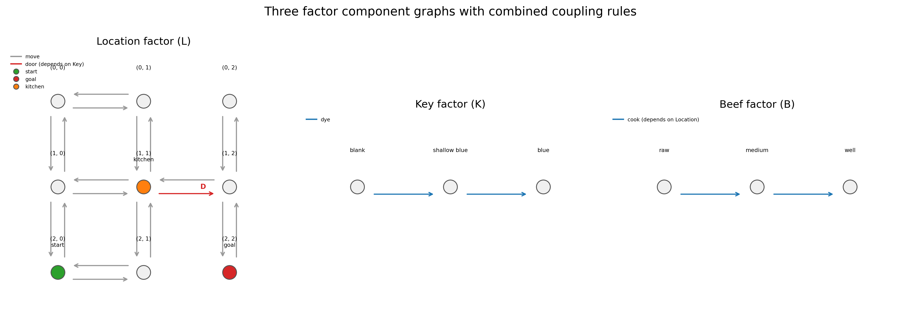
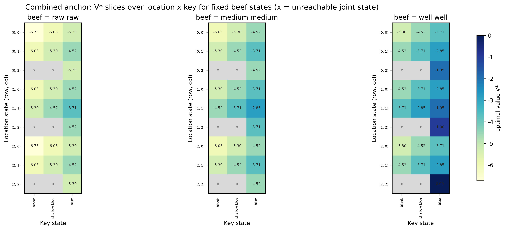
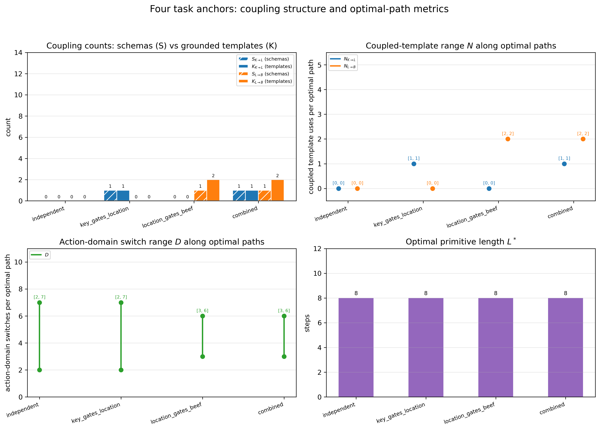

# 第三周报告：三因子 Factored MDP 与耦合复杂度

## 1. 符号表

| 对象 | 记号 | 定义 | 规模 |
| --- | --- | --- | ---: |
| Location factor | $l=(l_x,l_y)\in\mathcal L$ | $3\times3$ 位置网格，代码存储为 `(row, col)` | 9 |
| Key factor | $k=(k_h,k_t)\in\mathcal K$ | key-head 与 key-tail 属性 | 9 |
| Beef factor | $b=(b_c,b_d)\in\mathcal B$ | cooking 与 cutting 等级 | 9 |
| Hierarchical context | $c=(k,b)\in\mathcal C$ | $\mathcal C=\mathcal K\times\mathcal B$ | 81 |
| Joint state | $x=(l,k,b)=(l,c)\in\mathcal X$ | $\mathcal X=\mathcal L\times\mathcal K\times\mathcal B$ | 729 |
| Factor-$j$ schema set | $R_j$ | Factor-$j$ 的唯一动作名称集合 | task-dependent |
| Factor-$j$ template set | $E_j$ | 唯一有向三元组 $(s_j,a_j,s'_j)$ 集合 | $20/24/12$ |
| Schema coupling | $S_{i\to j}$ | 受 factor $i$ 影响的 factor-$j$ 动作模式数 | direction-specific |
| Template coupling | $K_{i\to j}$ | 受 factor $i$ 影响的 factor-$j$ 有向模板数 | direction-specific |
| Context instances | $M_{i\to j}$ | Coupled templates 在 factor-$i$ context 中的合法实例数 | direction-specific |
| Query coupling | $N_{i\to j}(\tau)$ | 轨迹 $\tau$ 中实际执行 coupled template 的次数 | path-specific |
| Optimal length | $L^*(q)$ | Query $q$ 的最短原语动作数 | query-specific |
| Domain switches | $D(\tau)$ | 相邻动作在 $L$、$K$、$B$ 域间的切换次数 | path-specific |

## 2. 三因子 MDP 与表示假设

环境状态表示为 $x=(l,k,b)$，其中 $x=(l,c)$ 与 $x=(l,k,b)$ 等价，$c=(k,b)$ 保留了位置-上下文的层级结构。

原语动作分属三个互斥域，每个动作仅修改单一因子：

$$
\begin{aligned}
F((l,k,b),a_L)&=(F_L(l,a_L;k),k,b),\\
F((l,k,b),a_K)&=(l,F_K(k,a_K),b),\\
F((l,k,b),a_B)&=(l,k,F_B(b,a_B;l)).
\end{aligned}
$$

当前版本仅激活 $K\to L$ 与 $L\to B$ 耦合。双向门需要钥匙状态 $k=(2,2)$ 才能通行；全部 6 条 `cook` 模板仅在厨房可执行，6 条 `cut` 模板仅在砧板可执行。不可执行动作直接从 $\mathcal A(x)$ 中排除，避免产生失败自环。每个非终止动作的奖励为 $-1$，折扣因子 $\gamma=0.95$，终止状态价值为 0。

本任务支持四种统计共享假设：平坦联合表征独立学习每个 $(l,k,b)$ 状态；单因子抽象仅复用一张组件图；对象分离抽象分别表示 Key 与 Beef，使一个对象的知识可跨另一对象状态迁移；稀疏三因子表征复用三张组件图，仅额外存储少量方向性耦合规则。本周工作实现了上述假设共用的环境及规范性分析框架。

图 1 展示了三张 $3\times3$ 组件图及 `combined` anchor 的激活规则。数值状态、语义标签和转移代码相互独立。

## 3. 结构耦合与查询级耦合

两个结构矩阵的行表示条件因子，列表示转移律受影响的因子：

$$
\mathbf S_{\mathrm{schema}}=
\begin{pmatrix}
0&S_{L\to K}&S_{L\to B}\\
S_{K\to L}&0&S_{K\to B}\\
S_{B\to L}&S_{B\to K}&0
\end{pmatrix},
\qquad
\mathbf K_{\mathrm{template}}=
\begin{pmatrix}
0&K_{L\to K}&K_{L\to B}\\
K_{K\to L}&0&K_{K\to B}\\
K_{B\to L}&K_{B\to K}&0
\end{pmatrix}.
$$

$S_{i\to j}$ 按动作名称计数，$K_{i\to j}$ 按有向三元组 $(s_j,a_j,s'_j)$ 计数，$M_{i\to j}$ 统计耦合模板在 factor-$i$ 上下文中的合法实例数。三个比例分别以 $|R_j|$、$|E_j|$ 和全部合法上下文实例为分母，口径不同，不可混用。当前分析范围限定为可达上下文。

结构耦合不保证某个查询的最短路径必然使用相应规则。对轨迹 $\tau$，$N_{i\to j}(\tau)$ 统计实际执行耦合 factor-$j$ 模板的次数；对全部最短路径，我们报告

$$
\mathcal R_{i\to j}(q)=
\left[
\min_{\tau\in\mathcal T^*(q)}N_{i\to j}(\tau),
\max_{\tau\in\mathcal T^*(q)}N_{i\to j}(\tau)
\right].
$$

动作域切换范围 $\mathcal R_D(q)$ 基于同一组最短路径计算。$L^*$、$\mathcal R_{i\to j}$ 与 $\mathcal R_D$ 分别刻画物理长度、耦合使用频次和跨因子调度复杂度，本文不构造加权综合指标。最短路径 DAG 上的动态规划同时计算路径数量和各指标的最小-最大值，避免由 PI 或 VI 的任意平局打破机制影响任务难度评估。

## 4. 四个 anchor 与匹配方法

四个 anchor 共用三张基础图、初始状态、精确终止状态、原语代价和动作顺序，仅切换两类前置条件。正式查询为

$$
x_0=((2,0),(0,0),(0,0)),
\qquad
x_G=((2,2),(2,2),(2,2)).
$$

Location 最短移动需 4 步，Key 目标需 2 步，Beef 目标需两次 `cook` 与两次 `cut`。门、厨房和砧板的位置经过调整，使四个条件均满足 $L^*=4+2+4=10$。

| Anchor | $(S_{K\to L},S_{L\to B})$ | $(K_{K\to L},K_{L\to B})$ | 规则 |
| --- | --- | --- | --- |
| `independent` | $(0,0)$ | $(0,0)$ | 移动与 Beef 加工均上下文无关 |
| `key_gates_location` | $(2,0)$ | $(2,0)$ | 双向门需要 $k=(2,2)$ |
| `location_gates_beef` | $(0,2)$ | $(0,12)$ | `cook` 需要厨房，`cut` 需要砧板 |
| `combined` | $(2,2)$ | $(2,12)$ | 同时启用两类规则 |

环境通过广度优先搜索从 $x_0$ 枚举真实可达状态，而非直接声明全部 729 个笛卡尔积组合。PI 与 VI 直接复用统一 MDP 接口。价值比较覆盖全部可达状态；当策略动作不同时，通过动作价值判断差异是否源于并列最优动作。

## 5. 结果

| anchor | $L^*$ | $\mathcal R_{K\to L}$ | $\mathcal R_{L\to B}$ | $\mathcal R_D$ | reachable | shortest paths | PI/VI max diff |
| --- | ---: | --- | --- | --- | ---: | ---: | ---: |
| `independent` | 10 | $[0,0]$ | $[0,0]$ | $[2,9]$ | 729 | 75600 | 0 |
| `key_gates_location` | 10 | $[1,1]$ | $[0,0]$ | $[2,9]$ | 594 | 30240 | 0 |
| `location_gates_beef` | 10 | $[0,0]$ | $[4,4]$ | $[5,8]$ | 729 | 90 | 0 |
| `combined` | 10 | $[1,1]$ | $[4,4]$ | $[5,8]$ | 594 | 56 | 0 |

钥匙门的两个方向分别对应 `left` 与 `right`，因此激活时 $S_{K\to L}=2/4$、$K_{K\to L}=2/20$、$M_{K\to L}=2/144$。位置门控的 Beef 涵盖 `cook` 与 `cut` 两个 schema 及全部 12 条模板，故 $S_{L\to B}=2/2$、$K_{L\to B}=12/12$、$M_{L\to B}=12/12$。其余四个非对角方向的 schema、template 和 instance 耦合均为 0。

图 2 固定 $b=(0,0)$、$(1,1)$ 与 $(2,2)$，展示 `combined` 环境的 $V^*(l,k\mid b)$。灰色格点表示从正式初始状态不可达的联合状态；三张二维切片无法替代完整的三因子价值函数。

图 3 对比了两层结构计数、最短路径上的耦合范围、域切换范围与 $L^*$。四个条件具有相同的最优长度，但路径结构存在差异。

动作统计揭示了 $L^*$ 未能控制的差异。`independent`、`key_gates_location`、`location_gates_beef` 和 `combined` 的平均分支因子依次为 6.227、6.066、5.040 和 4.912；合法动作总数依次为 4533、3597、3669 和 2913。PI 与 VI 选择不同动作的状态数依次为 402、357、442 和 357，但所有差异均可由并列最优动作解释，未发现真实策略错误。

## 6. 解释边界与留出重组

当前设计匹配了因子规模、初始状态、目标、原语代价和 $L^*$，但未匹配可达状态数、最短路径数量、动作可用性或分支因子。钥匙门使两个 anchor 的可达状态数从 729 降至 594；功能区规则显著减少 Beef 动作的平均可用性，并将最小域切换从 2 提升至 5。这些量必须作为干扰差异单独报告，不能将观测到的难度差异全部归因于耦合。

精确终止状态要求所有 anchor 最终达到 $k=(2,2)$。因此 Key 动作在 `independent` 中同样是完成条件，钥匙门并未额外增加”获得白色 Key”的动作数；它改变的是门边可用性、动作先后约束、可达状态和最短路径集合。保留该终止条件有利于固定三因子目标和 $L^*$，但后续行为解释不应将钥匙门条件描述为额外的钥匙获取成本。

下一阶段的留出重组应在训练中保留三张组件图的转移证据，同时留出部分 $(l,k,b)$ 组合。测试集需包含：跨 Beef 状态复用 Key 转移、跨 Key 状态复用 Beef 转移、跨对象上下文复用非耦合移动，以及在未见组合中遇到已学习耦合规则的试次。平坦学习器只能依赖联合状态经验；单因子学习器应表现出方向选择性的迁移；对象分离学习器应分别跨另一对象状态迁移 Key 与 Beef 知识；稀疏三因子学习器应在不变转移上广泛迁移，并将误差集中在激活的耦合项。表示假设应由试次级预测与错误位置区分，规划时长或最终路径长度本身无法识别学习器采用的状态表示。

本周结果建立了可复现的三因子任务生成器、方向性耦合指标与平局感知的查询分析。模型恢复、Reward Machine、Successor Representation 和 Weighted A* 属于后续阶段。
